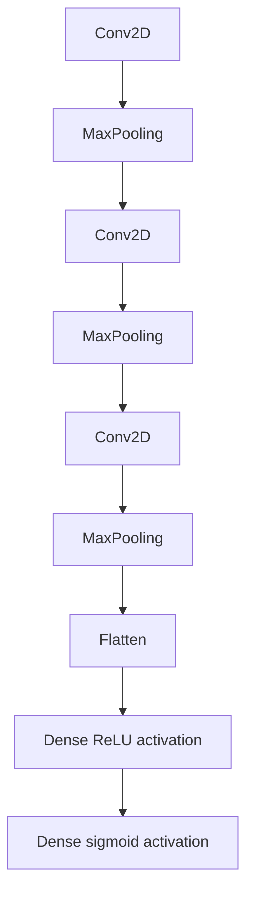

### HIV-RSFC-CNN-Classifier

##### Dataset: 

2D image matrix representations of resting state functional connectivity within people with HIV (PWH) and without HIV (PLWH) split into training and validation sets.

##### Model: 

3 sets of Convolution -> Max Pooling layers followed by a Flattening layer and 2 Dense layers (ReLU and Sigmoid activations respectively)

##### Observation:

- Number of training and test samples were low
- Could attempt different model architectures to see if it does any better
- At present, model performance is only a tad better than chance sometimes :)

